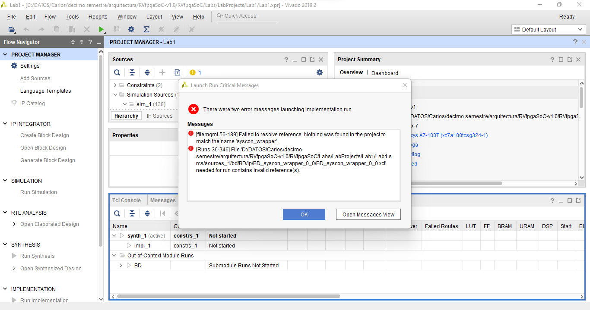

# 💻 RVfpga SoC THE IMAGINATION UNIVERSITY PROGRAMME

Se realizaron los dos primeros laboratorios RVfpga de IMAGINATION. Se hizo uso de los conocimientos adquiridos a lo largo del semestre en la materia arquitectura para computadores de la UIS, con la ayuda de las herramientas verilog, verilator, gtkwave entre otros. 

## 💻 Lab1

En este primer laboratorio se nos enseña la construcción del subconjunto SweRVolfX de RISC-V en un chip (SoC) a partir de bloques de construcción. 

Se realizaron los siguientes pasos:

1. Se empieza con la instalación del programa Verilog, en el cual se desarrollara el laboratorio.
2. Se crea el proyecto con la ayuda de la guía en el documento RVfpgaSoC.
3. Se ingresa a la creacion del diseño de bloques.
4. Se agregan los modulos necesarios para el diseño.
5. Se realizan las conexiones internas, entre los modulos del diseño, pin por pin o bus por bus dado el caso.
6. Se continua con las conexiones externas.
7. Finalizando el diseño y procediendo a generar el archivo verilog con la descripción de este mismo.
8. Por ultimo se configura la creación del bitstream para luego generarlo.


En el siguiente link se encuentra el PDF con todas las [conexiones entre modulos.](BlockDesign.pdf) (Para una mayor facilidad de lectura descargar el PDF)

### 🎯 Resultados


Cómo se puede observar por el gráfico anterior se llegó hasta la última parte como se nos indicó en la guía, generando el bitstream de manera correcta.

## 💻 Lab2

En este segundo laboratorio se nos indica como ejecutar programas escritos en el lenguaje C o en el lenguaje Assambly en el subconjunto SweRVolfX creado en el primer laboratorio haciendo uso de la herramienta Vivado block.

Se realizaron los siguientes pasos:

1. Se deben instalar los programas VSCode (en este se hace la instalación de PlatformIO), cygwin (en este se hace la instalación de verilator) y GTKWave.
2. Se obtiene del primer laboratorio el archivo BD.v en el cual se verifica que cada nombre de los modulos terminen en _0_0.
3. Se generan el binario para RVfpgaSim dentro de la terminal de cygwin.
4. Se obtiene el archivo trace.vcd realizando la simulación en PlatformIO.
5. Se muestran las señales en el GTKWave.

En el siguiente link se encuentra el archivo [trace.vcd](https://drive.google.com/file/d/1rNC20zOZOhfziusyGDlmFjSkUsuzrFOx/view) generado. 

### 🎯 Resultados

Se obtuvieron las siguientes señales en GTKWave, las cuales se dividirán en 3 instrucciones aritmético-lógicas de las primeras y segundas iteraciones del bucle.

- Primera: 

- Segunda:
 
- Tercera:


Se obtuvo de manera correcta las señales y los ciclos como lo mostraba la guía.

### 🔖 Errores
- Es importante descargar las versiones que se indican en la guia de instalación, se obtuvieron problemas al momento de generar el bitstream puesto que se usó una versión posterior a la 2019.2.
- El tener un buen procesador facilita y acelera el uso de las herramientas como vivado. Se tuvo que dejar durante varias horas encendido el computador para la generación del bitstream por los bajos recursos que presenta el procesador. 
- Al intentar hacer el bitstream se encontro un error donde no encontraba los modulos que componian el diseño. Se hizo la busqueda y los modulos estaban donde se especificaba, pero el projecto no los reconocia, para solucionarlo se tuvo que comenzar a hacer de nuevo todo el proyecto.



- En windows, cuando se buscaba el archivo generado trace.vcd este no aparecía en ninguna carpeta. Fue necesario el uso de otro sistema operatico como lo es Linux para hacer la generación de este.
- Durante el desarrollo del segundo laboratorio encontramos un error al momento de hacer la generación de bits para el RVfpgaSim, el cual se muestra en la siguiente imagen.


Este error se pudo arreglar agregando las siguientes librerias al código en C++ verilated.cpp, este archivo se encuentra dentro de la carpeta dentro de la carpeta cywin64 en archivos de programa y siguiendo la ruta que se nos muestra junto al error.
```
#include <limits>
#include <cstddef>
#include <iostream>
```

### 🔖 Conclusiones
- Al hacer un modulo es necesario hacer un etiquetado diciente de los terminales, en este laboratorio se podia intuir hacia donde iban o como era la conexión pertinente, haciendo facil este trabajo.
- En el momento de crear el archivo vivado del diseño creado, Vivado arroja una alerta indicando que todos los terminales que no esten interconectados seran enviados a tierra "0".
- Se realizaron las correctas simulaciones en el laboratorio 2, esto se puede inferir al momento de realizar la comparación de las señales obtenidas en gtwave con sus instrucciones.
- Al tener un pipelined de 9 etapas, el programa tarda en empezar a realizar todas las instrucciones estos 9 retardos, por esto primero el procesador se va preparando y pasando por cada etapa, para luego mostrar los resultados de cada instrucción, finalmente se repite el ciclo.

### 🔖 Referencias
- Curso de RISC-V [link](https://university.imgtec.com/resources/download/rvfpgasoc-v1-0/)
- Xilinx distribuidor de Vivado, programa usado en el laboratorio 1. [link](https://www.xilinx.com/)
- Visual Studio Code, programa usado en el laboratorio 2. [link](https://code.visualstudio.com/)
- Verilator, programa usado en el laboratorio 2. [link](https://verilator.org/guide/latest/index.html)
- Cygwin, programa usado en el laboratorio 2 para windows. [link](https://www.cygwin.com/)
- Gtkwave, programa usado en el laboratorio 2. [link](https://sourceforge.net/projects/gtkwave/)

### Autores
Diego Julian Plaza Quintero - Est. Ingenieria electrónica - 2172310
<br/>
egoplaza20@gmail.com
<br/>
Carlos Alberto Vásquez Serrano - Est. Ingenieria electrónica - 2170449
<br/>
carlosalvase@gmail.com
